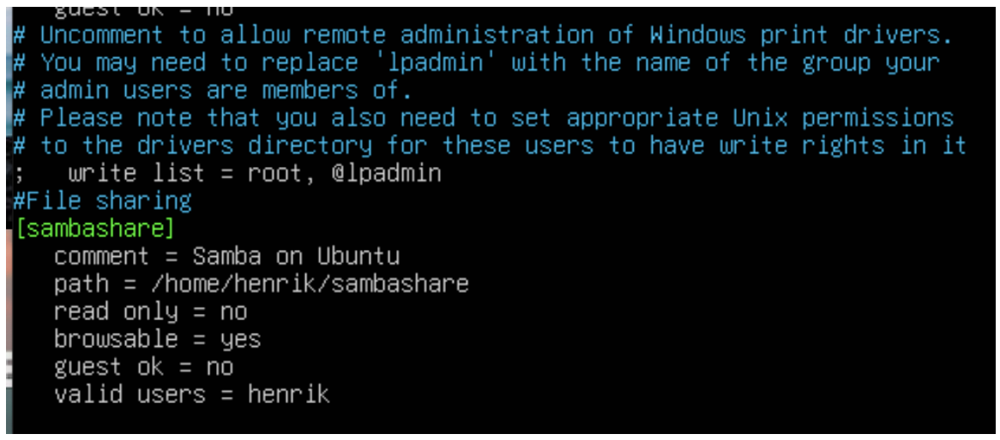
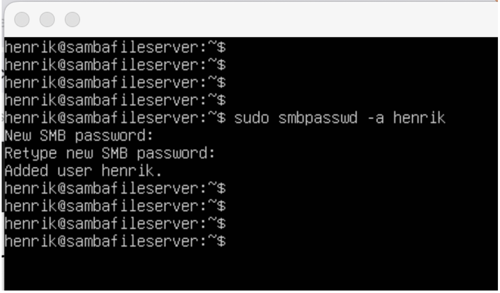
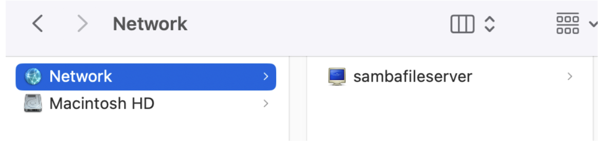
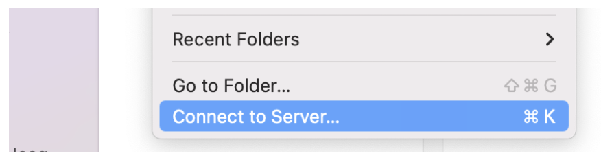
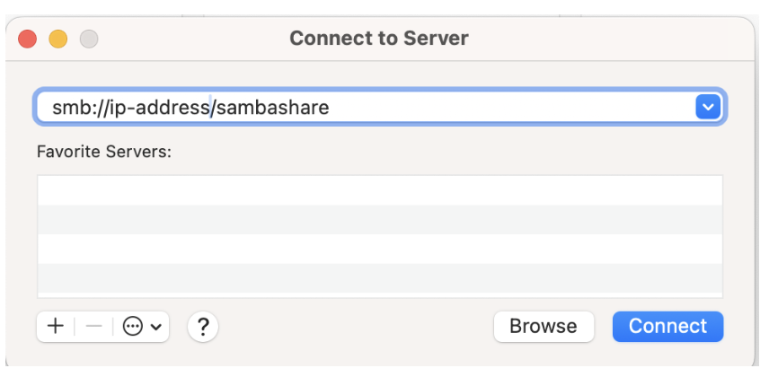
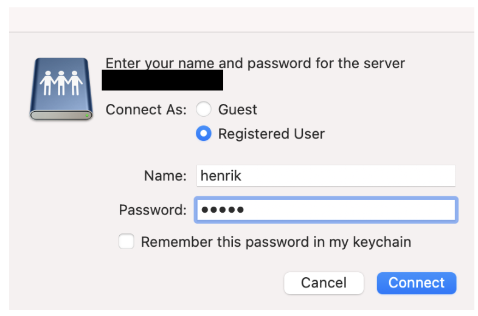
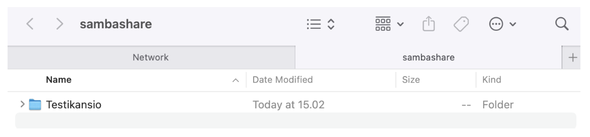
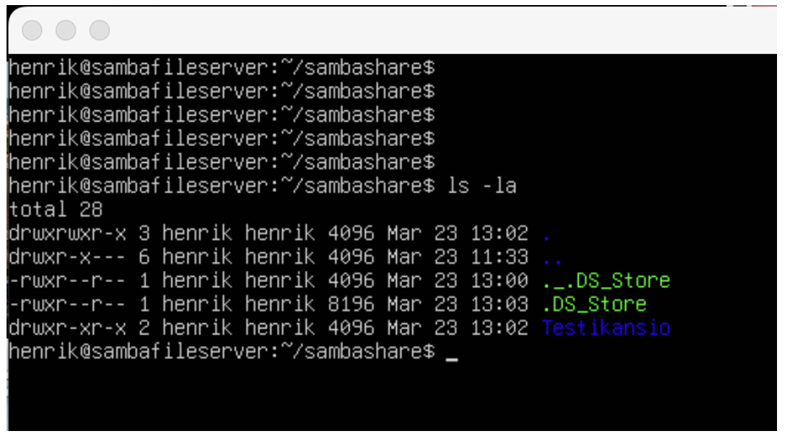

# Samba File Server Setup

**Author:** Henrik Einola  
**Course:** ICI003AS2A-3007  
**Date:** March 23, 2025  
**Institution:** Haaga-Helia University of Applied Sciences  

## Overview

A **Samba file server** enables file sharing across different operating systems over a network. It allows you to access your desktop files from a laptop and share files with Windows and macOS users.

## Requirements

- Ubuntu 16.04 LTS (tested on Ubuntu 24.04.2 LTS)
- Local LAN network

## Technical Details:

- Host: Mac mini M4 2024, macOS Sequoia 15.3.2
- Server: Linux, running on VirtualBox, Ubuntu 24.04.2 LTS 

### Verifying Environment

```bash
lsb_release -a
# Output: Release Ubuntu 24.04.2 LTS
```
Ensure your network settings are set to **Bridged Adapter** so the server gets its own IP.

Ping from host to server to test connectivity.

## Ubuntu Server Setup

- Perform a normal install of Ubuntu Server
- Change network adapter to **Bridged Adapter**
- Check IP with:

```bash
ip a
```

- Ping test from host machine to the server

## Installing Samba

```bash
sudo apt update
sudo apt install samba
whereis samba  # Verify Samba installation
```

Now we have a live ubuntu server running with samba installed. We have
verified that samba can be found on the system and that our network
connection between host and server is working.

## Configuring Samba

1. Create a directory for sharing:

```bash
mkdir /home/henrik/sambashare
```

2. Edit Samba configuration file:

```bash
sudo nano /etc/samba/smb.conf
```

3. Add the following to the end of the file:

```ini
[sambashare]
   comment = Samba on Ubuntu
   path = /home/henrik/sambashare
   read only = no
   browsable = yes
   valid users = henrik
```



### Explanation of Config Options

- **path**: Directory to share
- **read only**: `no` allows read/write access
- **browsable**: Appears under “Network” in file managers
- **valid users**: Limits access to specified users


## Firewall Configuration & Samba Restart

By default UFW (Uncomplicated Firewall) on Ubunut is disabled, I however
want it enabled for security reasons.

1. Enable UFW firewall:

```bash
sudo ufw enable
sudo ufw status
```

2. Restart Samba service - This saves
and refreshes changes we did in our config file

```bash
sudo service smbd restart
```

3. Allow Samba through firewall – Opens ports that
are required for Samba to share files

```bash
sudo ufw allow samba
```

## Creating Samba User

Since Samba does not use the system account password, we need to set
up a Samba password for our user account.

```bash
sudo smbpasswd -a henrik
```

Make sure `henrik` is a valid system user before setting a Samba password. Otherwise it will not work.



## Testing the Connection

Testing was done using a **Mac** client.



### Let's connect!

1. Open **Finder**
2. Click on **Go > Connect to Server**
3. Select **Connect to Server**



4. Enter ip address and directory name

```
smb://<server-ip>/sambashare
```



5. Enter credentials and connect



6. Create a folder in your file directory and verify server side upload



### Result

- Folder successfully created and visible on the server
- File sharing works across the network
- **Key takeaway**: Early verification of network connectivity ensured smooth setup



## Resources

- [Ubuntu Samba Tutorial](https://ubuntu.com/tutorials/install-and-configure-samba#1-overview)
